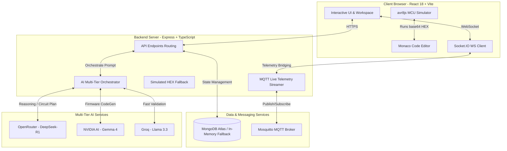
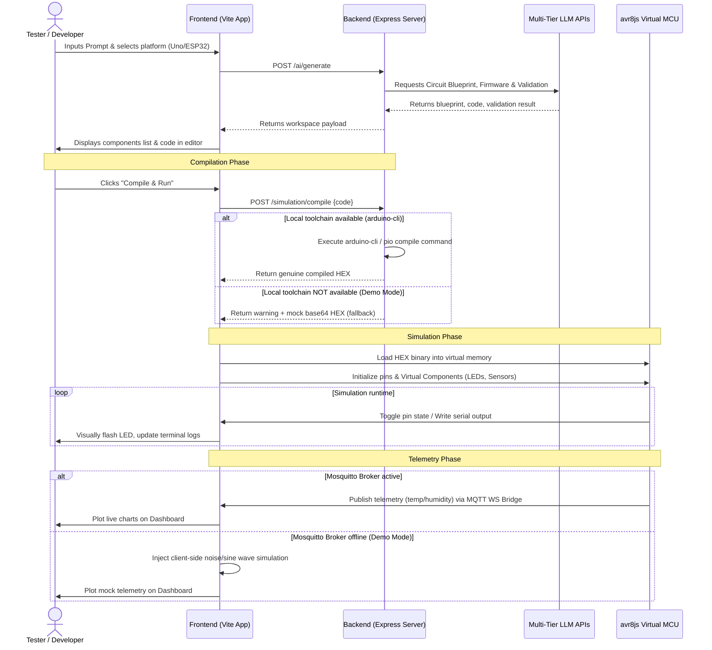
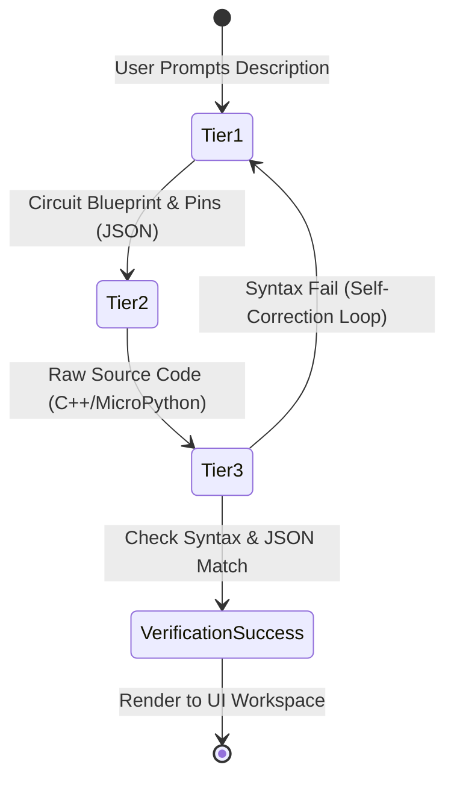

# AI IoT Astra — Project Documentation

This documentation provides an in-depth view of how **AI IoT Astra** works, its underlying architecture, API services, AI model tiers, the role of mock/demo fallbacks, and the next steps required to fully customize and deploy the system.

---

## 1. Project Status & Architecture Overview

**AI IoT Astra** is a full-stack, production-ready development platform designed to enable natural language hardware design, firmware compilation, and virtual execution in a browser-based simulator. 

### System Architecture



### Testing & Simulation Flow

This diagram outlines how testing and execution are verified step-by-step in the workspace, demonstrating how real compilers and fallback systems are engaged:



---


## 2. What is Mock/Demo Data?

To ensure a seamless development experience without requiring complex local hardware or system installations, the system automatically runs in a **Demo / Fallback Mode** when external dependencies are missing:

| Domain | Fallback Trigger | Behavior in Demo Mode |
| :--- | :--- | :--- |
| **Database** | MongoDB connection offline | The system runs on a transient **in-memory data store**. Projects and accounts can still be created, but data is cleared when the backend restarts. |
| **Code Compiler** | `arduino-cli` is not installed on the system PATH | The compilation endpoint intercepts the request, avoids throwing a shell execution error, logs a warning, and returns a static base64-encoded demo HEX string (`:00000001FF`) so the browser simulator can boot. |
| **Telemetry Feed** | Mosquitto MQTT Broker is offline | The frontend dashboard automatically switches to a client-side simulated data generator. It emits simulated sine/noise waves for temperature, humidity, and soil moisture (`aiot/device/*` topics) to show real-time charting. |
| **User Access** | Direct login bypass | The `/auth/demo` endpoint allows instant login with a pre-configured **Pro Tier** profile (unlimited workspace generations) without requiring an email verification flow. |

---

## 3. APIs Used in the Project

The system coordinates several API services to create the smart workspace:

1. **AI Reasoning & Generation APIs**:
   * **OpenRouter API** (`https://openrouter.ai/api/v1`): Serves as the Tier 1 Reasoning engine. Used to interpret natural language, extract components, and establish pin connections.
   * **NVIDIA AI API** (`https://integrate.api.nvidia.com/v1`): Serves as the Tier 2 Code Generator. It takes the circuit blueprint and outputs compiling-friendly C++/Python code.
   * **Groq API** (`https://api.groq.com/openai/v1`): Serves as the Tier 3 Validation engine. Evaluates the outputs, matches pin configurations against MCU constraints, and validates JSON formats.
2. **Local & Virtualized Hardware APIs**:
   * **avr8js**: A web-native execution engine that simulates AVR instruction sets directly in the browser's JavaScript environment.
   * **Express & Socket.IO**: Handles real-time WebSockets communication, updating serial outputs, compilation statuses, and telemetry.

---

## 4. AI Multi-Tier Routing Model

Rather than using a single model for every task (which is slow and expensive), AI IoT Astra leverages a **three-tier model architecture**:



### Model Specifications

1. **Tier 1 (Reasoning / Circuit Design Mode)**:
   * **Model**: `meta/llama-3.3-70b-instruct` on NVIDIA (fallback: `deepseek/deepseek-r1` on OpenRouter)
   * **Task**: Determines pin connections, logic compatibility, power requirements, and builds the Wokwi wiring blueprint.
   * **Reasoning**: Switching from DeepSeek-R1 as primary to Llama 3.3 70B avoids the 15-second latency overhead of chain-of-thought tokens while maintaining high-fidelity structured JSON output.
2. **Tier 2 (CodeGen Mode)**:
   * **Model**: `qwen/qwen2.5-coder-32b-instruct` on NVIDIA (fallback: `qwen/qwen-2.5-coder-32b-instruct` on OpenRouter)
   * **Task**: Generates C/C++ (Arduino/ESP-IDF) or MicroPython firmware code.
   * **Reasoning**: Qwen2.5-Coder is the #1 open-source code model, purpose-trained on embedded systems, libraries, and hardware interactions.
3. **Tier 3 (Validation & Component Extraction)**:
   * **Model**: `llama-3.1-8b-instant` on Groq (secondary fallback: `llama-3.3-70b-versatile` on Groq, final fallback: `meta-llama/llama-3.1-8b-instruct:free` on OpenRouter)
   * **Task**: Fast JSON checks, pin validation, and initial component list extraction from user prompt.
   * **Reasoning**: Groq executes the 8B model at ~1200 tokens/sec, reducing extraction time to less than 0.2s.

---

## 5. Next Steps: What You Need to Do More

To move from the simulated environment into a fully operational production setup, complete the following tasks:

### Task 1: Initialize Local Services via Docker
Start the dedicated database and messaging containers. Run this command in the project root:
```bash
docker-compose up mongodb mosquitto -d
```
* Once started, update the `backend/.env` file to point to the local instances:
  * `MONGODB_URI=mongodb://localhost:27017/ai-iot-astra`
  * `MQTT_BROKER_URL=mqtt://localhost:1883`

### Task 2: Install and Configure `arduino-cli`
To enable compilation of firmware code into real executables:
1. Download the [Arduino CLI](https://arduino.github.io/arduino-cli/latest/) binary.
2. Add the executable to your operating system's PATH.
3. Install the relevant platform cores:
   ```bash
   arduino-cli core update-index
   arduino-cli core install arduino:avr
   arduino-cli core install esp32:esp32
   ```

### Task 3: Setup Physical Hardware Deployments
1. Flash a physical board (e.g. ESP32 NodeMCU) using the generated code.
2. Configure the hardware client to connect to your Mosquitto broker IP.
3. Publish data on topics such as `aiot/device/temp` to watch the frontend charts update in real-time.

### Task 4: Set Up a Python Virtual Environment (`.venv`) for Firmware Tooling
Since flashing and compilation tools (such as **PlatformIO** and **esptool**) rely on Python packages, it is recommended to install them in a localized virtual environment:

1. **Create the Virtual Environment** in the project root:
   ```bash
   python -m venv .venv
   ```

2. **Activate the Virtual Environment**:
   * **Windows (PowerShell)**:
     ```powershell
     .venv\Scripts\Activate.ps1
     ```
   * **Windows (CMD)**:
     ```cmd
     .venv\Scripts\activate.bat
     ```
   * **macOS / Linux**:
     ```bash
     source .venv/bin/activate
     ```

3. **Install Dependencies** using `requirements.txt`:
   ```bash
   pip install -r requirements.txt
   ```

4. **Verify Installation**:
   ```bash
   pio --version
   ```

---

## 6. What We Did Till Now (Summary of Improvements)

Here is a summary of the optimizations and configuration improvements we completed:
1. **AI Routing Optimization**:
   * **Tier 1 (Reasoning / Circuit Design):** Shifted the primary model to NVIDIA's `meta/llama-3.3-70b-instruct` (low latency, strict JSON syntax), keeping OpenRouter `deepseek/deepseek-r1` as fallback. This completely removes the CoT token delay (saving up to 15 seconds per call).
   * **Tier 2 (Firmware Generation):** Shifted the primary model to NVIDIA's `qwen/qwen2.5-coder-32b-instruct` (fallback to OpenRouter). Setting `temperature: 0.05` ensures near-deterministic, valid C++/Arduino library syntax.
   * **Tier 3 (Validation & Quick Extraction):** Shifted the primary model to Groq's `llama-3.1-8b-instant` running at ~1200 T/s, reducing prompt parsing to ~0.2 seconds.
   * **Diagram Endpoint:** Re-routed `/ai/diagram` (generating Wokwi JSON) to use the `code` tier (Qwen2.5-Coder) instead of `reasoning` (DeepSeek) as it is a structured code output task rather than a reasoning task.
2. **Environment & Security Configurations**:
   * Set the `JWT_SECRET` in `backend/.env` to use the custom JWT token requested by the user.
   * Cleared out deprecated environment variables (`ANTHROPIC_API_KEY` and `SILICONFLOW_API_KEY`) and updated all config instructions, `docker-compose.yml`, `setup.sh`, and `README.md` to match the new `NVIDIA_API_KEY` and `GROQ_API_KEY` environment variables.
   * Removed obsolete version attributes in `docker-compose.yml` to silence Docker warnings.
3. **App Execution & Verification**:
   * Launched development servers for both Frontend and Backend concurrently.
   * Verified user registration, login flows, and page navigations (Workspace, Simulation sandbox, Dashboard, and Projects) using the browser subagent.

---

## 7. How to Run This Project

Follow these steps to run the complete workspace locally:

### Step 1: Start the Development Servers
In the project root directory (`aiot-studio/aiot-studio`), run:
```bash
npm run dev
```
This boots up:
* **Backend:** [http://localhost:4000](http://localhost:4000) (running `tsx watch src/index.ts`)
* **Frontend:** [http://localhost:5173](http://localhost:5173) (running Vite Dev Server)

### Step 2: (Optional) Start Mosquitto Broker
To receive real telemetry data (instead of mock sinusoids) on the dashboard, make sure Docker Desktop is running, and launch the MQTT broker:
```bash
docker-compose --env-file backend/.env up mosquitto -d
```
If you encounter permission errors on Windows, run this command in a PowerShell terminal opened as **Administrator**.


